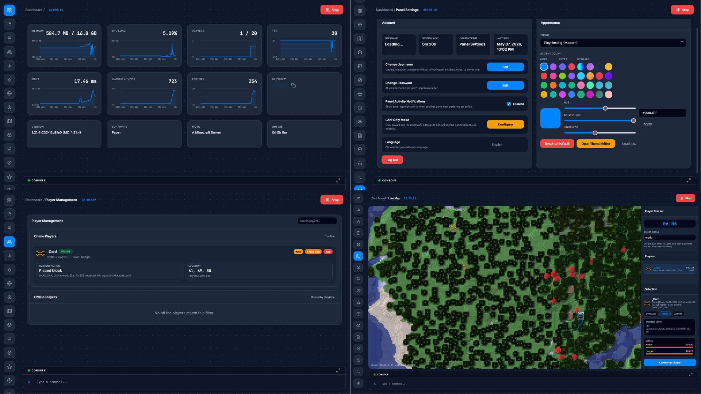
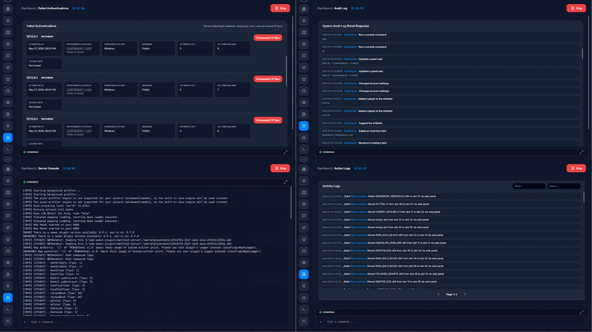
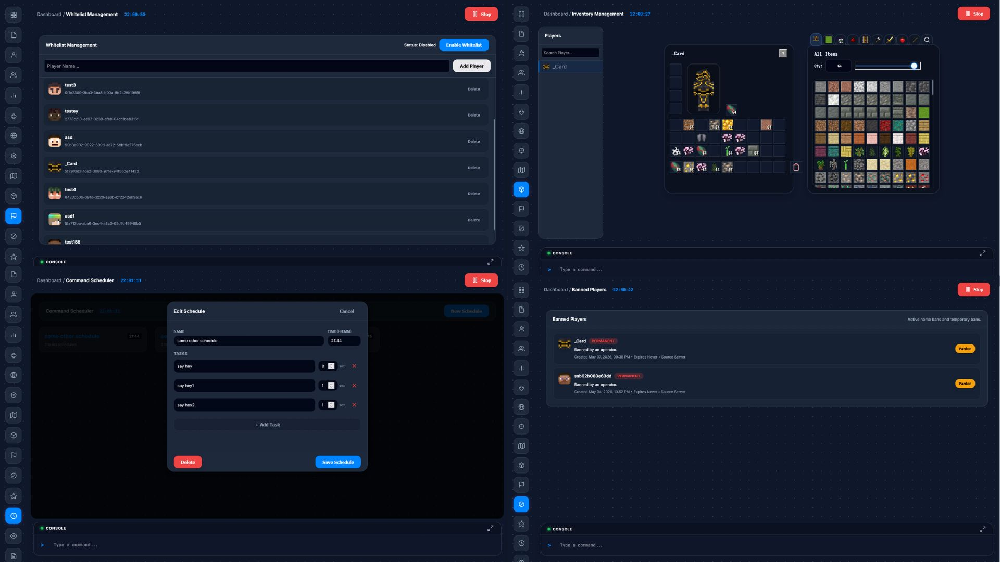
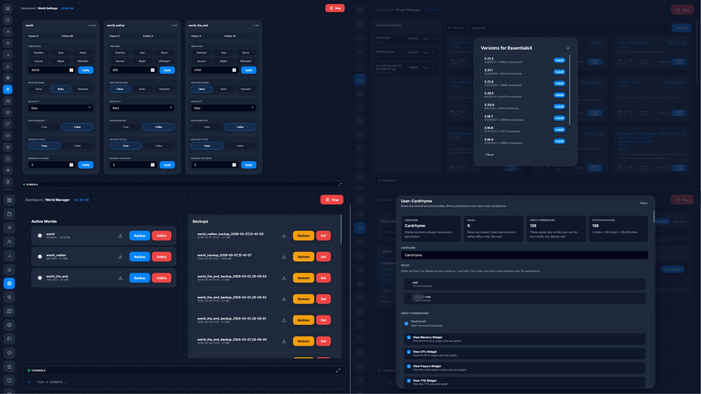
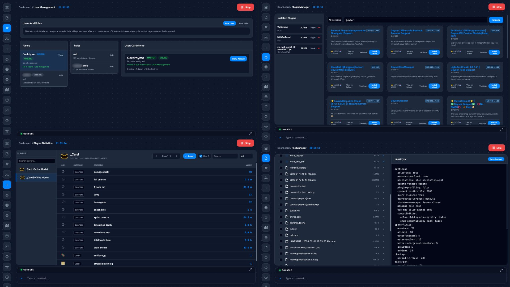

# [Obsisphere](https://cardrhyme206113.github.io/Obsisphere/) — Advanced Minecraft server management web UI

*A Minecraft plugin with an embedded web control panel for Paper/Spigot servers on 1.21.4+.*

Obsisphere is a full server-management panel that runs directly from the Minecraft server plugin: monitoring, file management, players, chat, permissions, worlds, backups, plugins, a live 3D map, inventory editing, logs, security tooling, appearance controls, and mobile support are all served from the same embedded web UI.

> **Current documentation:** this README now describes the implemented feature set rather than the old phase roadmap. For the exhaustive source-based inventory, see **[FEATURES.md](./FEATURES.md)**. The previous roadmap README is preserved at **[docs/README-legacy.md](./docs/README-legacy.md)**.

## Preview Images

# Current Feature Set

## Dashboard & server control

- Live memory, CPU, player-count, TPS, MSPT, loaded-chunk, entity-count, and uptime monitoring.
- Historical graphs with hover inspection and expanded views.
- Server IP/port, Minecraft version, software, MOTD, and uptime information.
- Individually permission-gated dashboard widgets.
- Server stop and restart controls with audit logging.

## File manager

- Directory browsing, breadcrumbs, metadata, multi-select, and bulk actions.
- Create files/folders and upload files/folders with progress feedback.
- In-browser text/code editing.
- Image and video preview.
- Rename, move, copy, and delete files/folders.
- Bulk ZIP download, server-side ZIP creation, and ZIP extraction.
- Hardened path/traversal handling.
- Granular permissions for browse/read/save/upload/create/rename/move/copy/delete/archive/extract/download operations.

## Authentication & account security

- One-time first-run master-account bootstrap flow.
- Expiring setup sessions.
- TOTP two-factor authentication with QR/OTP-auth setup.
- Forced onboarding for newly created panel users:
  - temporary credentials
  - mandatory password change
  - mandatory 2FA registration
- Password policy enforcement and salted PBKDF2 password hashing in the current implementation.
- Sliding authenticated sessions with configurable TTL.
- Per-session CSRF protection for state-changing requests.
- Logout/session invalidation.
- Username and password changes from account settings.

## Users, roles & permissions

- Master account plus normal panel users.
- Create/edit/delete panel users.
- Create/edit/delete roles and assign multiple roles to users.
- Direct user permissions plus inherited role permissions.
- Dependency-aware permission editor.
- Server-side enforcement for pages and individual sub-features.
- Session presence information:
  - online/offline panel state
  - current page
  - session age
  - last seen
- Per-user and per-role console policies:
  - unrestricted
  - whitelist
  - blacklist
  - exact-command rules
  - regex rules
  - contains-word rules

## Player management

- Separate Players page distinct from panel Users.
- Online player cards with coordinates/world, health, hunger, playtime, and recent activity.
- Offline player list with cached logout location, playtime, and last-played information.
- Player search/filtering and skin/head display.
- Kick, temporary-ban, and permanent-ban actions.
- Action reasons and configurable temporary-ban duration.
- Separate permissions for viewing, locations, kick, temp-ban, and ban.

## Public server chat

- Dedicated live public-chat page.
- Captures player chat, server broadcasts, `/say`, `/me`, joins, quits, and deaths.
- Bounded recent chat history.
- Send public in-game messages as the authenticated panel administrator.
- Panel messages identify the sending admin.
- Legacy/hex Minecraft color handling for panel-sent messages.
- Send cooldown protection and player-head presentation.
- Independent view/send permissions.

## Bans, whitelist & operators

- View and pardon player bans.
- View whitelist state and entries.
- Toggle whitelist enforcement.
- Add/remove whitelist entries with split permissions.
- View operators.
- Grant/revoke operator status with split permissions.

## Player statistics

- Player-stat roster with search and avatars.
- Statistics metadata/category catalog.
- Categories for custom stats, mined/broken/crafted/used/picked-up/dropped items, kills, and killed-by entities.
- Search and category filtering.
- Optional zero-value hiding.
- Paginated statistics table with icons and formatted values.
- TXT export; when zero values are hidden, they are omitted from the export too.
- Split permissions for player roster, metadata, and stat-file access.

## Plugin manager

- Lists loaded plugins and plugin JARs on disk.
- Shows name, version, runtime state, exact file, API version, and compatibility status where available.
- Inspects `plugin.yml` metadata and caches inspection results.
- Explicit `.jar` / `.jardisabled` handling.
- Exact-file enable/disable for the next restart rather than unsafe hot loading.
- Manual-enable confirmation when compatibility cannot be confirmed.
- Exact plugin-file deletion.
- Remote Spigot/Spiget search, version lookup, and install/download flow.
- Granular view/search/version/install/enable/disable/delete permissions.

## Worlds & manual backups

- List active worlds and backups separately.
- Download active worlds or backups as ZIP archives.
- Create manual backups.
- Restore backups.
- Delete active worlds or backup folders.
- Backup metadata tracks managed/manual state and retention information.
- Fine-grained active-world vs backup permissions.

## Automated backup policies

- Dedicated backup-policy manager.
- Create, update, enable/disable, and delete policies.
- Configure world, scheduled time, retention age, and number of latest backups to retain.
- Managed backup metadata and automatic retention pruning.
- Manual and policy-managed backups coexist.

## World settings

- Inspect world time, weather, difficulty, player count, entity count, gamerules, and folder size.
- Change time, weather, and difficulty.
- Supported gamerule editing includes Keep Inventory, Daylight Cycle, and Random Tick Speed.
- Separate read/write permissions for environment, population, gamerules, size, and individual setting families.

## Live 3D map

- WebGL-based live 3D world renderer rather than a static tile image.
- Multi-world support.
- Resource-pack-derived textures, models, blockstates, and texture atlas.
- Server-generated chunk/block payloads with section visibility culling and multiple detail levels.
- Persistent client IndexedDB chunk cache with revision/block-change invalidation.
- Bounded browser working set and bounded server-side hot chunk cache.
- Fingerprinted, browser-cacheable resource-pack assets.
- Server-sent map-change stream for near-realtime block updates.
- Player rendering with skins, smoothing/interpolation, orientation, armor, held items, names, and activity/focus information.
- Follow-camera mode and cave/interior-aware visibility behavior.
- Entity rendering for multiple Minecraft mobs/items.
- Day/night sky tint, sun/moon, fog, rain, FXAA, and bloom rendering.
- Block probing and supported container inspection.
- Map diagnostics/progress UI.
- Map rendering, polling, SSE, and queued chunk work pause when the map/tab is inactive and resume when reopened.
- Spatial entity queries instead of scanning every entity in the world for every map request.
- Split map/player-location/time/activity permissions.

## Inventory management

- Player roster/search and inventory inspection.
- Minecraft inventory slot layout and item icon renderer.
- 3D player/skin preview.
- Creative item catalog with categories and search.
- Item quantity selection.
- Drag/drop-style inventory editing.
- Move, add, and remove items.
- Inventory modifications are logged as player activity.
- Inventory rendering/API/item-render queues pause when the page/tab is inactive and resume when reopened.
- Granular permissions for roster, contents, item catalog, move, add, and remove.

## Command scheduler

- Create, edit, and delete command schedules.
- Multi-step command/task lists.
- Scheduler clock/time display.
- Backend schedule checks roughly once per second.
- Split permissions for list/time viewing and save/delete actions.

## X-Ray Watch

- Dedicated suspicious-mining monitor.
- Per-player X-Ray suspicion/counter data.
- Persistent watcher state.
- Permission-gated access.

## Live console

- Incremental live console output instead of repeatedly re-sending full history.
- Execute server commands from the panel.
- Docked/half-height and maximized/fullscreen modes.
- Command input/history behavior.
- Separate view/execute permissions.
- User/role console policies further restrict executable commands.

## Player Activity Logs

- SQLite-backed activity database retaining up to **100,000** records.
- 100 entries per page with player/action filtering.
- Repeated-event aggregation/count handling.
- Tracks:
  - block break/place
  - item pickup/drop
  - kills
  - throttled movement snapshots
  - item/block interaction
  - entity interaction and damage
  - item consumption
  - Elytra start/stop
  - inventory interaction
  - player-issued commands
  - web inventory modifications
- Recent activity is reused by Player Management and Live Map views.

## Panel Audit Logs & realtime notifications

- SQLite-backed audit database retaining up to **100,000** records.
- 100 records per page.
- Records panel user, action, HTTP method/endpoint, and sanitized request context.
- Sensitive audit values are redacted.
- Rich descriptions for known actions plus useful fallback endpoint/method details.
- Optional live panel-action toast notifications.
- Optional **Show Self in Live Notifications** setting.
- Optional realtime Player Activity toast feed.
- Notification queue limits visible toasts to three and rate-limits visual insertion to prevent screen-filling bursts.
- Clicking a toast clears the stack and temporarily pauses new popups with a short pause notice.
- Toast typography follows the selected panel-font behavior.

## Failed-authentication review & protection

- Brute-force/failed-login tracking and lockouts.
- Permanent IP-ban action.
- In-game/console recovery command to pardon failed-auth IP state.
- Failed Authentications page can expose, permission permitting:
  - source IP
  - approximate location
  - OS
  - browser
  - attempts remaining
  - total failure count
  - lock/permanent-ban state
- Failed-auth privacy controls for IP masking and personal-information visibility.
- AES-GCM helper for sensitive failed-auth fields.
- Field-level permissions for sensitive failed-auth information.

## Appearance, theme tools & font controls

- Current PlayHosting-style default theme.
- Bedrock, Basic/Legacy, Ferrum, and Stellar theme sources preserved as work-in-progress options.
- Custom accent presets plus HSL/hex controls.
- Solid/grid/dots/lines background patterns.
- Optional Minecraft font across the panel.
- Standalone theme editor.
- Custom CSS import and appearance reset controls.

## Global login/panel background

- Server-global background state shared across browsers/clients.
- Apply to login only, panel only, or both.
- Equirectangular 360° mode or flat-image mode.
- Embedded default 2:1 equirectangular image.
- Adjustable rotation speed, blur, darkness, vignette, and container opacity.
- Upload JPG/PNG/WebP custom backgrounds with size/type/signature validation.
- Custom image stored server-side.
- Reset restores the embedded default.
- Revision/refresh handling keeps different clients synchronized.
- Background rotation pauses while the browser tab is hidden.

## Internationalization & responsive/mobile UI

- Runtime i18n layer.
- English and Turkish translation files.
- Live language switching from Settings.
- Responsive desktop/mobile layouts.
- Mobile bottom navigation plus a full-page More menu.
- Mobile-aware Inventory and Live Map layouts.
- Shared themed modal/dialog system instead of browser-native confirm/prompt dialogs for panel workflows.
- Translated toast controls and notification settings.

## Security, request handling & persistence

- Server-side permission enforcement on top of frontend access gating.
- CSRF verification for authenticated mutations.
- HTTP-only/session cookie handling with same-site behavior.
- Strict and bounded JSON request parsing.
- Request/file/upload size limits in sensitive handlers.
- Central path-safety handling and ZIP extraction traversal checks.
- Audit secret/token sanitization.
- LAN-only access mode with private/local network reasoning.
- SQLite databases for panel accounts/roles, Activity Logs, and Audit Logs.
- JSON persistence for schedules, backup policies, and backup metadata.
- YAML persistence for logout-location cache and X-Ray watcher state.
- Migration support for older activity/audit storage formats.

## Build modes

- `AUTH_REQUIRED` — normal authenticated build.
- `DEV_NO_AUTH` — loopback-only development build with a synthetic wildcard-permission development user/session.
- `DEV_NO_AUTH_LAN` — no-auth development build intended for LAN testing.

---

## Detailed feature reference

The list above is intended to make the repository landing page useful without reading the code. For a more implementation-oriented inventory, including finer sub-feature detail, see **[FEATURES.md](./FEATURES.md)**.

## Legacy roadmap

The previous README was primarily a Phase 1 / Phase 2 / Phase 3 development checklist and no longer accurately represented the current scope of the panel. It has been retired from the repository front page and preserved unchanged for historical context at **[docs/README-legacy.md](./docs/README-legacy.md)**.

## License

Obsisphere is distributed under the repository's **GNU General Public License v3.0** license. See [LICENSE](./LICENSE).
