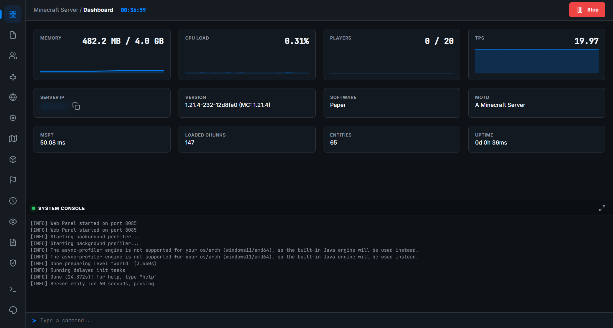
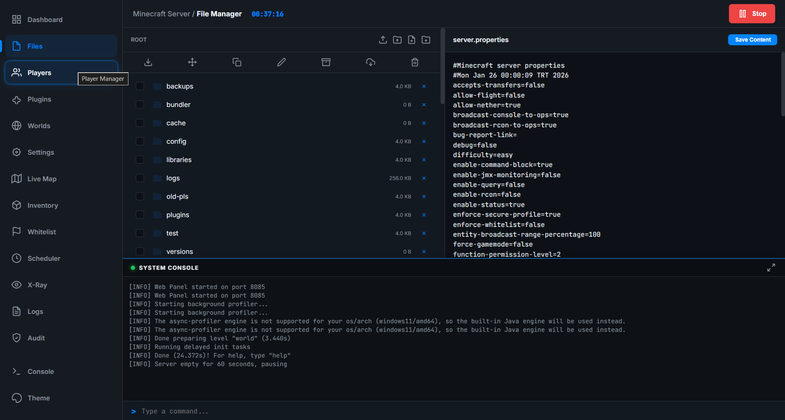
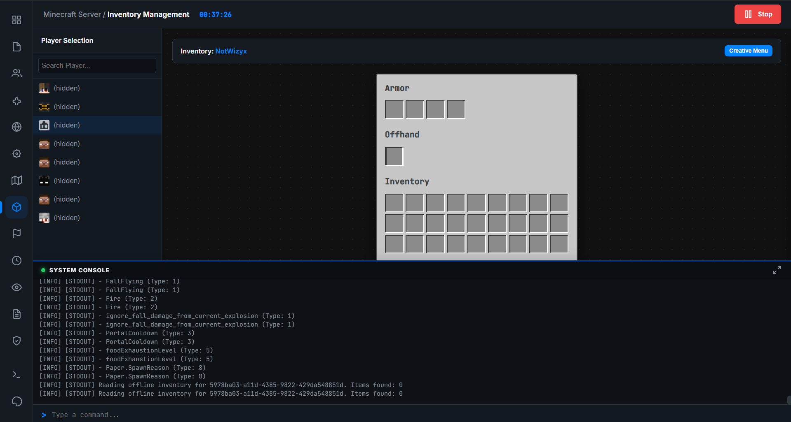
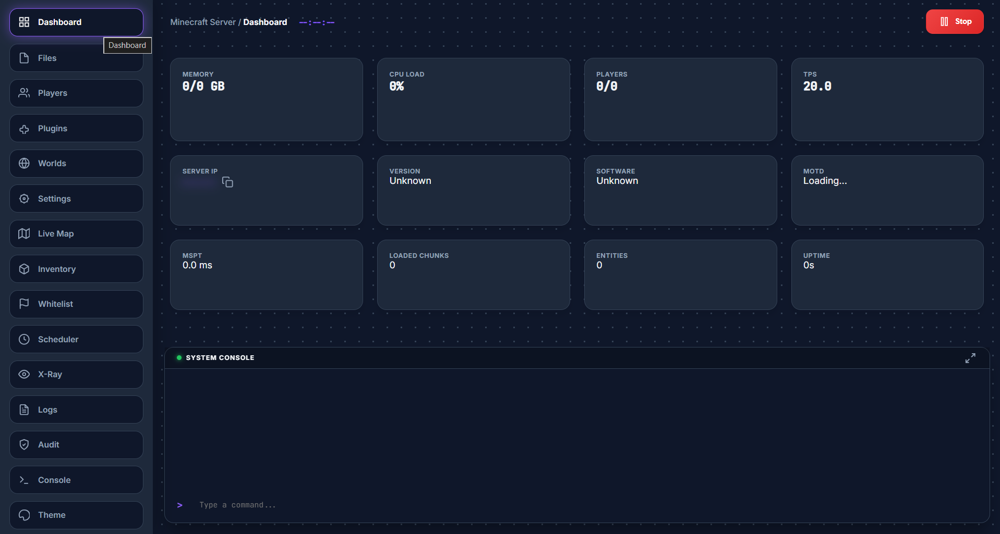

# Obsisphere - Advanced server management web-ui.
### **⚠️ WARNING! This plugin may be susceptible to attacks of many kinds, and it has simple security measures like session-based token system. Only use in secure development environments, DO NOT USE IN PRODUCTION!**
*A minecraft plugin with advanced web capabilities that works on versions 1.21.4 and up, made by cardrhyme.*
Note: Currenty, all the features below works, but there may be bugs. Remember: This was a rough outline of how I would want an ideal minecraft plugin with web management abilities to look like.
Note: The basic theme works perfectly, meanwhile some other teams - especially 'playhosting', a theme inspired by the play.hosting control panel, might have issues with clipping, and the terminal at times. These issues will be fixed within time. And many, many more themes will be added as the next development phases continue!
## Previews Images (Some with placeholder data)

# Results of development phase 1:
## Features:
### 📊 Dashboard & Monitoring
- [x] **Real-time Graphs**: Visual monitoring for Memory Usage, CPU Load, Player Count, and TPS (Ticks Per Second).
- [x] **Server Information**: Displays Server IP (copyable), Version, Software (e.g., Paper), and MOTD.
- [x] **Performance Stats**: Live tracking of MSPT (Milliseconds Per Tick), Loaded Chunks, Entity Count, and Uptime.
- [x] **Server Control**: Quick access button to **Stop** the server with confirmation.
### 📁 File Manager
- [x] **File Browser**: Navigate through server directories with breadcrumbs.
- [x] **File Operations**:
  - [x] **Create**: New Files and Directories.
  - [x] **Upload**: Upload individual files or entire folders.
  - [x] **Edit**: In-browser code editor for text-based files (supporting syntax highlighting concepts).
  - [x] **View Media**: Preview images and videos directly in the browser.
  - [x] **Download**: Individual file download.
  - [x] **Delete**: Remove files or folders.
- [x] **Bulk Actions** (Multi-select):
  - [x] **Bulk Download**: Zip and download multiple selected files.
  - [x] **Bulk Move**: Move selected items to a new location.
  - [x] **Bulk Copy**: Copy selected items to a new location.
  - [x] **Bulk Rename**: Rename selected items.
  - [x] **Archive**: Compress selected files into a `.zip` archive.
  - [x] **Unarchive**: Extract `.zip` files.
  - [x] **Bulk Delete**: Delete multiple items at once.
### 👥 Player Management
- [x] **Player List**: View online players with avatars, names, and UUIDs.
- [x] **Moderation Actions**:
  - [x] **Kick**: Kick a player with a custom reason.
  - [x] **Ban**: Permanently ban a player.
  - [x] **Tempban**: Temporarily ban a player with preset (2h, 1d, 1w, etc.) or custom duration (seconds).
- [x] **Whitelist Management**:
  - [x] **Toggle**: Enable/Disable server whitelist.
  - [x] **Add Player**: Add a player to the whitelist by name.
  - [x] **Remove Player**: Remove a player from the whitelist.
  - [x] **Status Indicator**: Visual indication of whitelist status.
### 🧩 Plugin Manager
- [x] **Installed Plugins**: List all active plugins with status badges (Enabled/Disabled).
- [x] **Plugin Control**:
  - [x] **Toggle**: Enable or Disable individual plugins (requires restart).
  - [x] **Delete**: Uninstall plugins.
- [x] **Spigot Resource Browser**:
  - [x] **Search**: Search for new plugins from SpigotMC.
  - [x] **Version Filtering**: Filter resources by supported Minecraft versions (1.8 - 1.21).
  - [x] **Detailed View**: View plugin description, rating, and download count.
  - [x] **Version History**: View and install specific versions of a plugin.
  - [x] **Install**: One-click installation of resources.
### 🌍 World Management
- [x] **Active Worlds**: List all loaded worlds with dimension and size.
- [x] **Backups**:
  - [x] **Create Backup**: Instant backup of a specific world.
  - [x] **List Backups**: View existing backups with timestamps and sizes.
  - [x] **Restore**: Rollback a world to a previous backup state.
  - [x] **Delete**: Remove old backups.
- [x] **Download**: Download world folders or specific backup archives.
- [x] **World Settings**:
  - [x] **Time Control**: Set world time (Day/Night).
  - [x] **Weather Control**: Toggle weather (Clear/Rain).
  - [x] **Difficulty**: Change world difficulty (Peaceful, Easy, Normal, Hard).
### 🗺️ Live Map
- [x] **Real-time Rendering**: Canvas-based top-down map view.
- [x] **Navigation**: Drag to pan, scroll to zoom (dynamic scaling).
- [x] **Multi-world Support**: Switch view between different worlds.
- [x] **Player Tracking**: See real-time positions of players on the map.
- [x] **Dynamic Tiling**: Fetches map chunks on demand for performance.
### 🎒 Inventory Management
- [x] **Player Inspection**: View inventory of any offline/online player.
- [x] **Equipment Slots**: Visual display of Armor and Offhand slots.
- [x] **Main Inventory**: 27-slot main inventory grid.
- [x] **Hotbar**: 9-slot hotbar display.
- [x] **Creative Menu**: Overlay to search and view available items (mock/creative interface).
### 📅 Scheduler
- [x] **Task Scheduling**: Automate console commands.
- [x] **Time-based Execution**: Run tasks at specific server times (HH:mm).
- [x] **Multi-step Tasks**: Create schedules with multiple commands and delays between them.
- [x] **Management**: Create, Edit, and Delete schedules.
### 👁️ X-Ray Watch
- [x] **Anti-Cheat Analysis**: Heuristic analysis of mining patterns.
- [x] **Ore Ratios**: Calculates ratio of mined ores (Diamond, Gold, etc.) vs. Stone.
- [x] **Alerts**: Visual highlighting for suspicious ratios (>2%).
### 📜 Logs & Audits
- [x] **Activity Logs**:
  - [x] **Filtering**: Filter logs by Player name or Action type.
  - [x] **Pagination**: Browse through log history.
  - [x] **Details**: View timestamps, actors, actions, and detailed metadata.
- [x] **Audit Log**:
  - [x] **System Tracking**: Logs every panel API request.
  - [x] **Request Inspection**: View method, path, and JSON body of requests.
### 💻 System Console
- [x] **Live Output**: Real-time streaming of server console logs.
- [x] **Command Input**: Send commands directly to the server.
- [x] **ANSI Color Support**: Renders console colors for readability.
- [x] **View Modes**: Toggle between docked (bottom) and fullscreen console.
### 🎨 Appearance & Customization
- [x] **Theme System**:
  - [x] **Presets**: Switch between bundled themes (Basic, Ferrum, PlayHosting, Stellar).
  - [x] **Persistence**: Saves user theme preference across sessions.
- [x] **Visual Tweaks**:
  - [x] **Accent Color**: Persistent custom accent color picker.
  - [x] **Background Patterns**: Persistent pattern selector (Solid, Grid, Dots, Lines, etc.).
  - [x] **Mobile Scaling**: Responsive adjustments for smaller screens.
- [x] **Advanced Theme Editor**:
  - [x] **Live Inspector**: Hover and click elements in the preview to select them.
  - [x] **Visual Controls**: Sliders and pickers for Layout, Colors, and Typography.
  - [x] **Global Variables**: Edit CSS variables (`:root`) with real-time preview.
  - [x] **Custom CSS**: Inject raw CSS for fine-grained control.
  - [x] **Reset Functionality**: Reset individual properties or global variables to defaults.
  - [x] **Import/Export**: Save themes as JSON/CSS or load external theme files.
- [x] **Reset Appearance**: One-click button to revert all visual customizations to default.
### 🛠️ General UI/UX
- [x] **Responsive Sidebar**: Collapsible navigation rail with hover expansion.
- [x] **Toast Notifications**: Non-intrusive alerts for success/error states.
- [x] **Modals**: Custom styled dialogs for confirmations and inputs.
- [x] **Google Translate**: Integrated widget for language translation.

# Development phase 2 - The future plans:
- [ ] SSH Support
- [ ] SFTP Support
- [ ] Allowing the http / https, ssh and sftp protocols to all work from a single port by checking the first few bytes of each request (Need to do some research on this and look at the viability of this solution.)
- [ ] More themes, and allowing accent colors and shapes to be set for the mass majority of said themes. (Including the current playhosting, ferrum themes.)
- [ ] Making an advanced API for the control panel for those who want to set custom control panels for their minecraft server, but don't want to go trough the pain of setting up an API. (Suggestion of a friend.)
- [ ] Allowing backwards support for older versions down to 1.16.5. (Currently 1.21.4+)
- [ ] Improving the live world map, and allowing teleportation to player on click at sidebar.
- [ ] Fixing visual / css issues, especially on the playhosting theme.
- [ ] Making the audit log more user friendly, less cluttered, and less prone to going over gigabytes if left alone. (Really gotta fix that... Currently, it shows full file edits, api requests, and this is the best and most functional way to do it, but for non-power users, this might prone to becoming a cause for a lag spike than anything else.)
- [ ] Permissions for control panel users and admins. OP's can make new admin and non-admin users. Admin users have absolute power and the capability of altering non-admin users' permissions at will. There will be a new page added, and a permissions system to be used on command creation, and a detailed permission system, allowing the toggling of each api endpoint - but in a user friendly and fashionable way, which will make some pages invisible to non-admin users if said permissions for given pages are denied.
- [ ] Adding support for worldguard, luckperms, and many other plugins:
      1. Worldguard: Show worldguard chunks in the worldmap, and when clicked on maps, protect said chunks with worldguard as admin.
      2. Luckperms: Shortcut for editing with luckperms from rightwithin the webui. (Luckperms page, when clicked, types /luckperms edit, gets url, iframes. If /luckperms edit fails, shows 'Luckperms is not available on this server.")
      3. And many more that I cannot think of at the moment, but will be available and shown in 'Supported integrations with plugins' page that will be integrated in the panel in the future, showing each plugin, obviously the ones that exists on your server first. Each plugin with integration that is on server will be listed as a seperate page in webui panel.
- [ ] Fix possible security loopholes and issues. (If you find any, please tell.)

# PLANNED SECURITY MEASURES FOR FUTURE IMPLEMENATION:
### AUTH
- Argon2id or bcrypt
- Login rate limiting (5 attempts / min per IP)
- Account lockout after X failures

### SESSION
- 256-bit random session IDs
- HttpOnly + Secure
- Expire after inactivity (30 min)
- Rotate on privilege change
- Server-side session store

### CSRF
- CSRF token in cookie + header
- Required for POST/PUT/DELETE

### FILE SYSTEM
- Canonical path check
- Block symlinks escape
- Zip extraction path validation 
- Configurable root jail
  
### API
- Rate limiting (IP + session)
- Request body size limits
- JSON size limits

### CONSOLE
- Optional command blacklist:
    - stop 
    - restart
    - op
    - lp user *  
        (server owner can disable blacklist)

### LOGS
- Rotate logs
- Max size
- Async write

### TRANSPORT
- Force HTTPS or show red warning banner
    

### HARDENING
- Security config page:
    - Enable safe mode
    - Disable file manager
    - Disable plugin installer
    - LAN only mode
